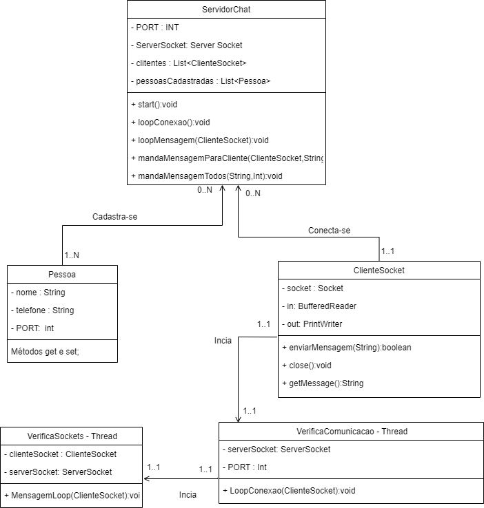
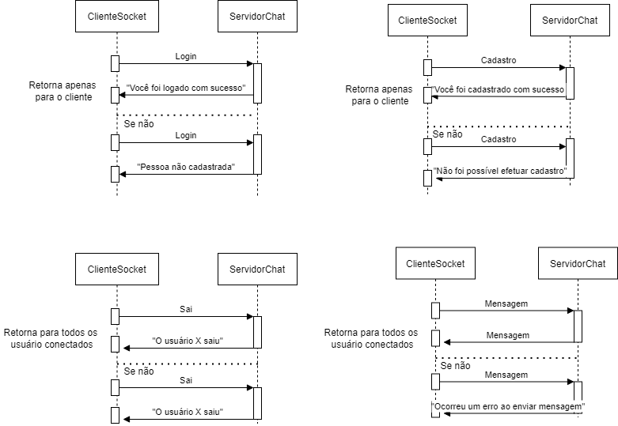

# Trabalho 3 realizado para Desenvolvimento de Sistemas Paralelos e Distribuídos.
 ## TeleZap
 
O TeleZap é um sistema no qual consiste na troca de mensagens entre clientes dentro de um servidor, o qual pode aceitar várias conexões dentro do mesmo servidor possibilitando a conversa entre pessoas em um grupo, o qual deve retratar as mensagens em tempo real que estão sendo enviadas, é utilizado a linguagem JAVA com o objetivo do trabalho utilizar de Sockets e Threads como aprendido em aula anteriormente.
 
 ## Requisitos funcionais
 
 * RF01 - Terá o cadastro do cliente para conectar ao servidor.
 * RF02 - Realizar a troca de mensagens dentro de um chat entre TODOS os clientes.
 * RF03 - Terá apenas um chat global
 * RF04 - Atualizar troca de mensagens em tempo real.
 * RF05 - O sistema terá uma tela de cadastro de cliente
 * RF06 - O sistema terá uma tela de login
 * RF07 - O sistema terá uma tela de Chat
 
  ## Requisitos não-funcionais
  * RNF1 - Deve ser distribuído e executar simultanamente em no mínimo 3 clientes (hosts) diferentes.
  * RFN2 - Se necessário, pode ser implementado um servidor para ser acessado pelos clientes.
  * RFN3 - A comunicação pode ser realizada através de Sockets
  * RFN4 - Sockets ociosos não podem existir (todos devem ser fechados logo após a comunicação).
  * RFN5 -  A aplicação cliente deve ter interface gráfica.

 ## Diagrama de classes
 

<<<<<<< HEAD
 
=======
 
>>>>>>> parent of 536e384 (Alterações realizadas para rodar em servidores diferentes)
 

 
 ## Diagramas de sequência
  

<<<<<<< HEAD
 
=======
 
>>>>>>> parent of 536e384 (Alterações realizadas para rodar em servidores diferentes)
 

 
 
 ##### <a href="https://www.linkedin.com/in/ramon-vinicius-marqueviski-a4ba801a1/">Ramon Vinicius Marqueviski</a>
 
