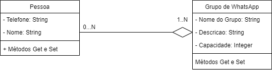
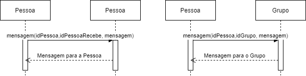

# Trabalho 3 realizado para Desenvolvimento de Sistemas Paralelos e Distribuídos.
 ## TeleZap
 
O TeleZap é um sistema no qual consiste na troca de mensagens entre clientes dentro de um servidor, o qual pode aceitar várias conexões dentro do mesmo servidor possibilitando a conversa entre duas pessoas ou também a criação de um grupo, o qual deve retratar as mensagens em tempo real que estão sendo enviadas, é utilizado a linguagem JAVA com o objetivo do trabalho utilizar de Sockets e Threads como aprendido em aula anteriormente.
 
 🚧  Projeto em construção!!!  🚧
 
 ## Requisitos funcionais
 
 * RF01 - CRUD Grupo.
 * RF02 - Realizar a troca de mensagens entre apenas CLIENTES.
 * RF03 - Realizar a troca de mensagens dentro do grupo.
 * RF04 - Atualizar troca de mensagens em tempo real.
 
 ## Diagrama de classes preliminar
 

 
 

 
 ## Diagramas de sequência preliminar
  

 
 

 
 
 ##### <a href="https://www.linkedin.com/in/ramon-vinicius-marqueviski-a4ba801a1/">Ramon Vinicius Marqueviski</a> e João Pedro Solagna
 
